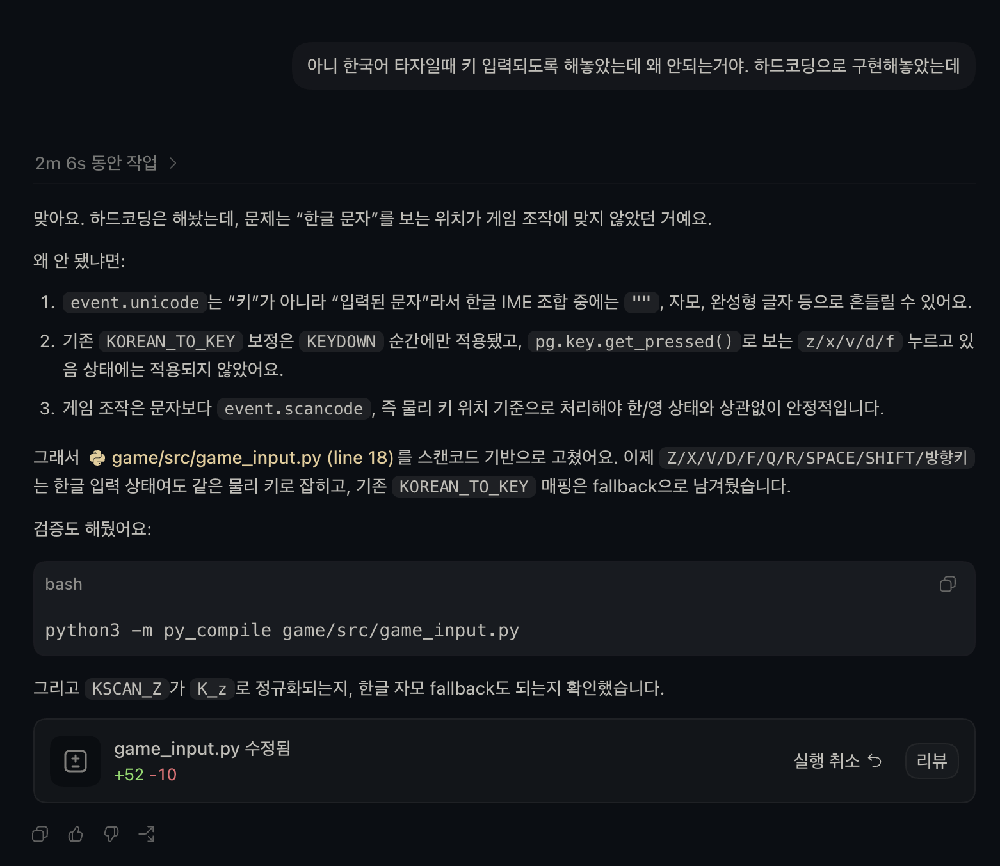
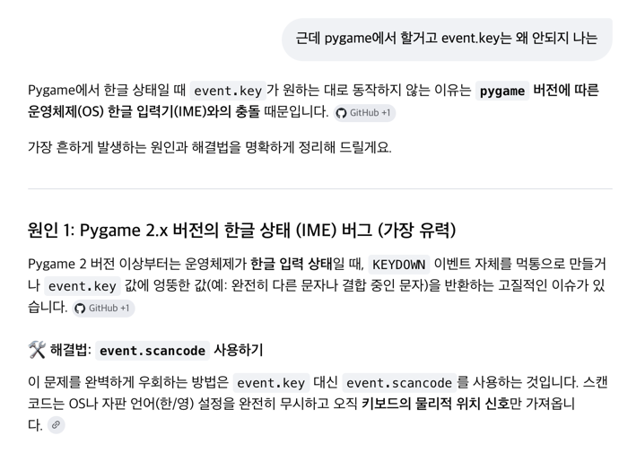
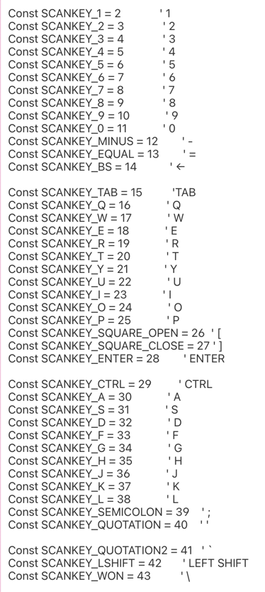

# 에러 해결 일지.


> 6월 11일
## 문제점

`python3 main.py` 실행 시 다음 에러로 실행이 안됏음 ㅜㅜ:

```
Traceback (most recent call last):
  File ".../game/main.py", line 14, in main
    player = Kirby(x=100, y=600)
  File ".../game/src/kirby.py", line 28, in loadMove
    self.kirby1 = load.load_image("Kirby1.png")
  File ".../game/load.py", line 5, in load_image
    image = pygame.image.load(path)
pygame.error: File is not a Windows BMP file
```

- 목요일(6/11)까지는 잘 작동했는데..?? 갑자기 이랬음
- 코드는 전혀 바뀌지 않았는데 갑자기 PNG 로드에서 실패.

## 원인

코드나 이미지 파일의 문제가 아니었던것.....

진짜 원인은 설치된 pygame에 SDL_image 지원이 빠져 있었더라는 거!!!!!

```python
pygame.image.get_extended()   # → False
```

- `pygame.image.get_extended()`가 `False`면 pygame은 BMP 파일만 읽을 수 있음.
그래서? PNG를 넘기면 "File is not a Windows BMP file"라는 에러가 발생.

### 근데 여기서 SDL / SDL_image 란 뭘까???????

- **SDL (Simple DirectMedia Layer)**: pygame이 내부적으로 쓰는 저수준 라이브러리. 창 띄우기, 키보드/마우스 입력, 소리, 화면 그리기 등을 담당. pygame은 이 SDL을 파이썬에서 쉽게 쓰도록 감싼 래퍼.
- **SDL_image**: PNG·JPG 같은 다양한 이미지 포맷을 읽게 해주는 확장 라이브러리. 이게 없으면 SDL은 BMP만 읽을 수 있음.
- `get_extended() == True` 라는 건 SDL_image가 함께 설치돼 있다는 뜻.

## 해결 방법은?

`pygame`을 `pygame-ce`(커뮤니티 에디션)로 교체. `import pygame` API가 동일함 -> pygame-ce라고 안해도 되는게 신기방기.

---

# 한글 폰트 깨짐 & 한국어 키보드 입력 불가 해결 기록

> 작성일: 2026-06-13

---

## 문제 1: 한글 폰트 깨짐 (ChatGPT 사용 ㅎㅎ)

### 증상

`pygame.font.SysFont(None, size)`로 폰트를 생성하면 한글이 깨져서 표시됨 (□□□ 또는 물음표).

### 원인

`SysFont(None, size)`는 pygame 기본 폰트를 사용하는데, 이 폰트는 한글을 지원하지 않음.

### 올바른 해결

`pygame.font.match_font(name)`으로 시스템에 폰트가 존재하는지 먼저 확인.

```python
# load.py
_KOREAN_FONT_CANDIDATES = ["applegothic", "malgun gothic", "nanumgothic", "gulim", "dotum"]

def get_korean_font(size):
    for name in _KOREAN_FONT_CANDIDATES:
        if pygame.font.match_font(name):   # 실제 존재 여부 확인
            return pygame.font.SysFont(name, size)
    return pygame.font.Font(None, size)    # 없으면 기본 폰트
```

추가로, 폰트 객체를 `draw_hud()` 같은 매 프레임 호출 함수 안에서 생성하면 성능이 낭비됨.
초기화 시 한 번만 만들어 `self.font`에 캐시해서 재사용.

```python
# kirby.py __init__
self.font = load.get_korean_font(18)  # 초기화 시 1회 생성
```

### 우선순위 목록

| 폰트 이름 | 지원 OS |
|---|---|
| applegothic | macOS |
| malgun gothic | Windows |
| nanumgothic | Linux / 나눔폰트 설치 시 |
| gulim / dotum | Windows (구버전) |

---

_## 문제 2: 한국어 키보드 입력 시 게임 키 입력 불가 

### 증상

macOS에서 키보드 입력 방식을 한국어로 설정해두면 Z, X, C, Space 등 게임 키가 전혀 반응하지 않음.
---

### 윤준서의 해결 방안.
하드코딩을 박아서 한국어가 입력되어도 영어처럼 바꾸도록 구현.

```python
KOREAN_TO_KEY = {
    "ㄱ": pg.K_r,
    "ㄴ": pg.K_s,
    "ㄷ": pg.K_e,
    "ㄹ": pg.K_f,
    "ㅁ": pg.K_a,
    "ㅂ": pg.K_q,
    "ㅅ": pg.K_t,
    "ㅇ": pg.K_d,
    "ㅈ": pg.K_w,
    "ㅊ": pg.K_c,
    "ㅋ": pg.K_z,
    "ㅌ": pg.K_x,
    "ㅍ": pg.K_v,
    "ㅎ": pg.K_g,
    "ㅏ": pg.K_k,
    "ㅐ": pg.K_o,
    "ㅑ": pg.K_i,
    "ㅓ": pg.K_j,
    "ㅔ": pg.K_p,
    "ㅕ": pg.K_u,
    "ㅗ": pg.K_h,
    "ㅛ": pg.K_y,
    "ㅜ": pg.K_n,
    "ㅠ": pg.K_b,
    "ㅡ": pg.K_m,
    "ㅣ": pg.K_l,
}

def _check_pressed_key(actions, key):
    if key in NAV_UP_KEYS:
        actions.up_pressed = True
    if key in NAV_DOWN_KEYS:
        actions.down_pressed = True
    if key in NAV_LEFT_KEYS:
        actions.left_pressed = True
    if key in NAV_RIGHT_KEYS:
        actions.right_pressed = True
    if key in CONFIRM_KEYS:
        actions.confirm_pressed = True

    if key == KEY_BINDINGS["settings"]:
        actions.settings_pressed = True
    elif key == KEY_BINDINGS["quit_title"]:
        actions.title_quit_pressed = True
    elif key == KEY_BINDINGS["restart"]:
        actions.restart_requested = True
    elif key == KEY_BINDINGS["spit"]:
        actions.spit_pressed = True
    elif key == KEY_BINDINGS["gulp"]:
        actions.gulp_pressed = True
    elif key == KEY_BINDINGS["punch"]:
        actions.punch_pressed = True
    elif key == KEY_BINDINGS["kick"]:
        actions.kick_pressed = True
    elif key == KEY_BINDINGS["stage_enter"]:
        actions.enter_pressed = True


def _normalized_key(event):
    if hasattr(event, "unicode") and event.unicode in KOREAN_TO_KEY:
        return KOREAN_TO_KEY[event.unicode]
    return event.key
```
참고한 자료: https://joyfulgenie.tistory.com/entry/pygame에서-한글입력-컴포넌트-만들기<br>
아니 이게 안되는거에요.;.;.;.;.;.;.;.;.<br>
그래서 지피티 시켰는데

### codex가 이상하게 해결함. 그니까 잘못 해결함


> 이렇게 해도 그대로였음. 오히려 영어타자여도 작동 안했음.

더 이상해져서 그냥 인터넷에 찾아봄.

https://m.blog.naver.com/hojun0313/222536756619
여기에는 event.unicode에 저장된 값을 확인하는 방법을 사용합니다.
근데 그 방식은 환경에 따라서 안될수도있다고 하더라고요 그리고 실제로 제가 안되었어서 다른걸 찾아봤습니다.


scancode라는게 있었습니다.
https://kkamagui.tistory.com/476
이 블로그에 scancode상수가 정리되어있습니다.


그래서 
```python
KEY_SCANCODES = {
    "jump": pg.KSCAN_SPACE,
    "inhale": pg.KSCAN_Z,
    "spit": pg.KSCAN_X,
    "attack": pg.KSCAN_V,
    "gulp": pg.KSCAN_DOWN,
    "settings": pg.KSCAN_ESCAPE,
    "quit_title": pg.KSCAN_Q,
    "restart": pg.KSCAN_R,
    "punch": pg.KSCAN_D,
    "kick": pg.KSCAN_F,
    "stage_enter": pg.KSCAN_UP,
}
```

이렇게 스캔코드로 바인딩을 해놓고, 


```python
SCANCODE_TO_KEY = {
    pg.KSCAN_UP: pg.K_UP,
    pg.KSCAN_DOWN: pg.K_DOWN,
    pg.KSCAN_LEFT: pg.K_LEFT,
    pg.KSCAN_RIGHT: pg.K_RIGHT,
    pg.KSCAN_RETURN: pg.K_RETURN,
    pg.KSCAN_KP_ENTER: pg.K_KP_ENTER,
    pg.KSCAN_SPACE: pg.K_SPACE,
    pg.KSCAN_LSHIFT: pg.K_LSHIFT,
    pg.KSCAN_ESCAPE: pg.K_ESCAPE,
    pg.KSCAN_Q: pg.K_q,
    pg.KSCAN_R: pg.K_r,
    pg.KSCAN_Z: pg.K_z,
    pg.KSCAN_X: pg.K_x,
    pg.KSCAN_V: pg.K_v,
    pg.KSCAN_D: pg.K_d,
    pg.KSCAN_F: pg.K_f,
}
```

```python
def _normalized_key(event):
    scancode = getattr(event, "scancode", None)
    if scancode in SCANCODE_TO_KEY:
        return SCANCODE_TO_KEY[scancode]
    return event.key
```

이렇게 스캔코드 받은걸 일반 키보드 입력 상수를 바인딩 시켜놓은것들(
```python
KEY_BINDINGS = {
    "jump": pg.K_SPACE,
    "inhale": pg.K_z,
    "spit": pg.K_x,
    "attack": pg.K_v,
    "gulp": pg.K_DOWN,
    "settings": pg.K_ESCAPE,
    "quit_title": pg.K_q,
    "restart": pg.K_r,
    "punch": pg.K_d,
    "kick": pg.K_f,
    "stage_enter": pg.K_UP,
}
```
) 로 바꿔주는 코드를 작성해서 해결하였다. (저의 피땀눈물이 전부 담겨있는 코드입니다 ㅠㅜㅜㅠㅜㅠ)


# 게임 맵 구성 그리고 몬스터 ai
> 완전한 인공지능을 통해 생성한 코드입니다. ("enemy.py", "stage.py", "object.py")


# 효과음 출처
https://sounds.spriters-resource.com/wii/kirbysreturntodreamland/asset/394725/